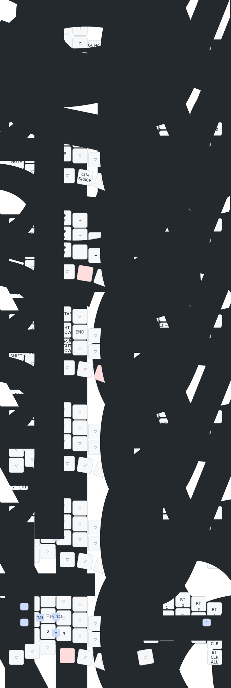

# roBa キーマップ

roBa(トラックボール付き左右分割キーボード)の現在のキーマップのドキュメント。キーマップ本体は [`config/roBa.keymap`](../../config/roBa.keymap) で定義している。

macOS + US 配列を前提に、dotfiles の運用(左右⌘での IME 切り替え、tmux prefix `Ctrl+Space`、vim)に合わせてカスタマイズしている。

> この画像(`roBa.svg`)と `roBa.yaml` は [keymap-drawer](https://github.com/caksoylar/keymap-drawer) による自動生成物。更新方法は[後述](#キーマップ図の更新)。

## レイヤー構成

| # | 名前 | 発動方法 | 内容 |
|---|------|---------|------|
| 0 | default | ベース | QWERTY 配列 + IME 切り替え |
| 1 | FUNCTION | Enter(右親指)ホールド | F1〜F13・メディアキー・tmux prefix |
| 2 | NUM | Space(左親指)ホールド | 左手テンキー + 右手記号 |
| 3 | ARROW | 英数(左親指)ホールド | 矢印・Home/End・タブ切り替え・Xcode ショートカット |
| 4 | MOUSE | トラックボール操作で自動有効化 | マウスボタン(MB1/MB2/MB3) |
| 5 | SCROLL | I キーホールド | トラックボールをスクロールに切り替え |
| 6 | layer_6 | かな(左親指)ホールド | Bluetooth 管理・bootloader |

## デフォルトレイヤー(0)

- **配列**: QWERTY。US 配列前提
- **親指行(左)**: `Ctrl` / `Cmd` / `Alt` / `かな` / `Space` / `英数`
- **親指行(右)**: `Backspace` / `Enter` / `Del`

### IME 切り替え

Space 両隣の親指キーは `LANG1`(かな)/ `LANG2`(英数)を送信する。macOS がネイティブに解釈するキーコードのため Karabiner 不要で、iPad/iPhone に Bluetooth 接続したときも有効。

### ホールド&タップキー

| キー | タップ | ホールド |
|------|--------|---------|
| かな(左親指) | `LANG1` を送信してレイヤー0へ | レイヤー6(BT 管理) |
| Space(左親指) | `Space` | レイヤー2(NUM) |
| 英数(左親指) | `LANG2` を送信してレイヤー0へ | レイヤー3(ARROW) |
| Enter(右親指) | `Enter` | レイヤー1(FUNCTION) |
| `A` | `A` | 左 Ctrl(ホームロウ Ctrl) |
| `Z` | `Z` | 左 Shift |
| `I` | `I` | レイヤー5(SCROLL) |

かな/英数のタップは `lt_to_layer_0`(カスタム hold-tap)経由で、タップ時に必ずレイヤー0へ戻ってからキーを送信する。

`A` のホームロウ Ctrl(`hml`)は誤発動対策として、**右手側のキーと組み合わせたときだけ**ホールド判定になる(`hold-trigger-key-positions` + `require-prior-idle-ms: 125`)。vim-tmux-navigator の `Ctrl+h/j/k/l` をホームポジションのまま出すのが主目的。`Ctrl+C` など左手同士の組み合わせは左下隅の `Ctrl` キーを使う。

### その他の特殊キー

- 左手内側(G の右): `Cmd+Shift+4`(macOS の範囲スクリーンショット)
- 右手内側の縦列: `-` / `;`(上から)

## コンボ(同時押し)

| キー | 出力 |
|------|------|
| Q + W | `Esc` + 英数(vim 用。IME を確実に OFF) |
| A + S | 英数(`LANG2` + レイヤー0へ) |
| S + D | `Tab` |
| D + F | `Shift+Tab` |
| L + `'` | `"` |
| C + V | `=` |

`Esc` は `esc_eisuu` マクロで、Karabiner の「Esc で英数も送る」ルールのファームウェア版。

## 各レイヤーの詳細

### 1: FUNCTION

- F キーは US キーボードの F 列と同じ並びで左から順に配置: 左手上段 `F1`〜`F5`、右手上段 `F6`〜`F10`、左手中段 `F11` `F12` `F13`
- 左手中段の残り: 輝度(`BRI_DN` / `BRI_UP`)
- 左手下段: `MUTE` / `VOL_DN` / `VOL_UP` / `再生・停止`
- Space 位置: `Ctrl+Space`(tmux prefix。右親指ホールド + 左親指タップで送信)

### 2: NUM

左手にテンキー(`KP_0`〜`KP_9`、四則演算)、右手に記号(`^ & ~ ( ) _ ! @ # $ % [ ] { } \ |`)。`KP_0` はホールドで左 Shift。

### 3: ARROW

- 左手ホームポジションに `←↓→` + `Home`/`End`、上段に `↑`
- `Ctrl+Tab` / `Ctrl+Shift+Tab`(タブ切り替え)、`Esc`(+英数)
- `Cmd+Shift+←` / `Cmd+Shift+→`(行頭/行末まで選択、下段)
- 右手上段(Xcode): `Cmd+R`(Run)/ `Cmd+B`(Build)/ `Cmd+U`(Test)/ `Cmd+.`(Stop)
- 右手中段(Xcode): `Ctrl+Cmd+←`(戻る)/ `Ctrl+Cmd+→`(進む)/ `Cmd+Shift+O`(Open Quickly)/ `Cmd+Shift+J`(Reveal in Navigator)
- ロータリーエンコーダ: `Ctrl+PgUp` / `Ctrl+PgDn`(デフォルトレイヤーでは `PgUp` / `PgDn`)

### 4: MOUSE(自動マウスレイヤー)

トラックボールを動かすと自動で有効になる(`automouse-layer = <4>`、タイムアウト 700ms)。右手ホームポジションに `左クリック(J)` / `中クリック(K)` / `右クリック(L)`。

### 5: SCROLL

このレイヤーが有効な間、トラックボールの移動がスクロールになる(`scroll-layers = <5>`)。キー割り当てはすべて透過。

### 6: layer_6(Bluetooth 管理)

- 右手上段: BT プロファイル 0〜4 の選択
- `P` 位置下段: `BT_CLR`(現在のプロファイル削除)、右下: `BT_CLR_ALL`(全削除)
- 右手内側: `&bootloader`(ファームウェア書き込みモード)
- 左手下段: `1` `2` `3`(通常の数字キー)

## トラックボール(PMW3610)

センサー設定は [`boards/shields/roBa/roBa_R.conf`](../../boards/shields/roBa/roBa_R.conf) で定義。主な設定:

- CPI 400、ポーリングレート 125Hz(ソフトウェア)
- 自動マウスレイヤーのタイムアウト 700ms
- スクロール刻み 16、スクロール X 軸反転
- スマートアルゴリズム有効

## キーマップ図の更新

`roBa.svg` / `roBa.yaml` は次のどちらかで更新する。

- **ローカル**: リポジトリルートで `make draw`(初回は `.venv/` に keymap-drawer を自動インストール)
- **CI**: GitHub Actions の [Draw Keymap ワークフロー](../../.github/workflows/draw.yml)を手動実行(workflow_dispatch)
